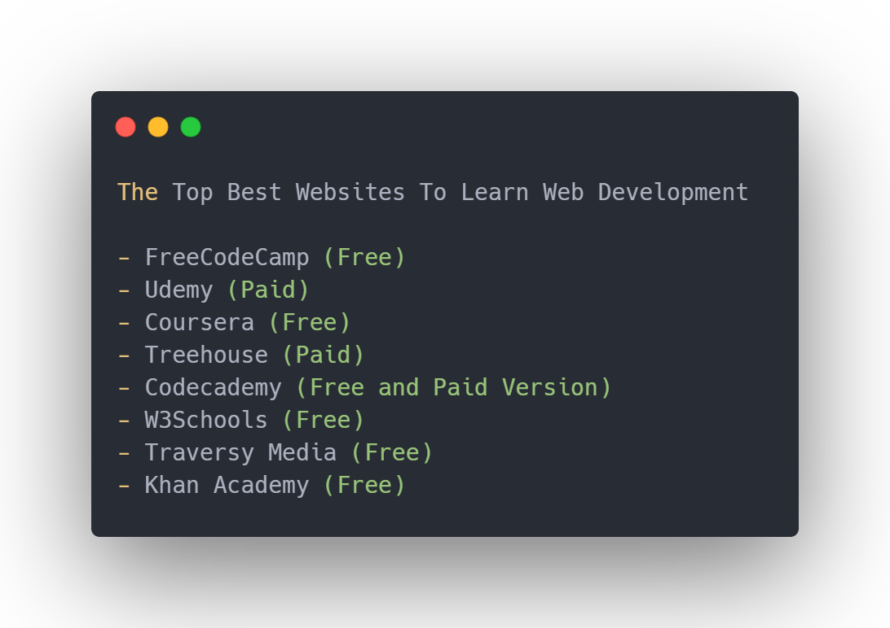

# Links

### HTML Links (Day 01 - 06)

* [HTML](https://books.goalkicker.com/HTML5Book/)&#x20;
* [HTML Canvas](https://books.goalkicker.com/HTML5CanvasBook/)

### HTML & CSS links (Day 01 - 15)

[FreeCodeCamp](https://www.freecodecamp.org/learn/responsive-web-design/)

### DEV

[https://dev.to/surajondev/40-useful-resources-for-mastering-web-1i0h](https://dev.to/surajondev/40-useful-resources-for-mastering-web-1i0h)

### ANIMISTA

[https://animista.net/play/text](https://animista.net/play/text)

### CSS Effects

[https://emilkowalski.github.io/css-effects-snippets/](https://emilkowalski.github.io/css-effects-snippets/)
